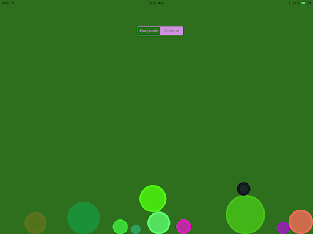
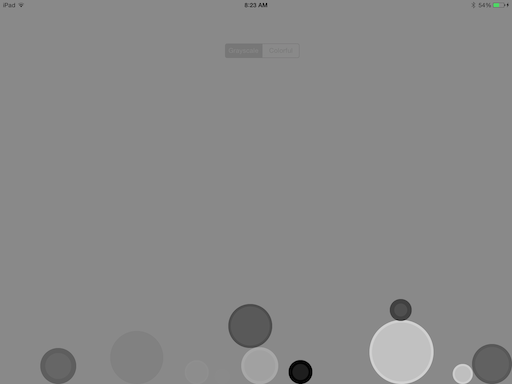
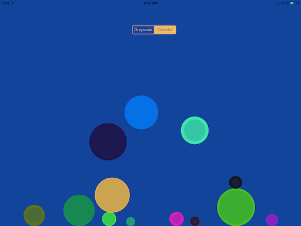

balls
=====

This is an app that combines UIKit dynamics, colors, and sound effects for an engaging experience.

What It Looks Like:
---

Gameplay:
---
To play, simply tap on the screen. When you tap on the screen, a ball will drop from wherever you tapped, unless you tap on a ball. We'll talk more about that in a moment.

As you create balls, they'll fall to the bottom of the screen. When two balls collide, the background will change colors to the average of color of the two balls.

If you tap on a ball, you'll simply pick up whatever ball you've tapped on. When you're finished dragging that ball around, release it to drop it to the bottom.

You can only have up to 10 balls on the screen at once, for performance reasons. If you spawn a ball when there ae already 10, one or more of the older balls will shatter.

Requirements:
---

iOS 7.0 + iPad

Balls requires iOS 7 to run because it makes use of new technologies included with UIKit Dynamics.

License:
---
All rights reserved. 